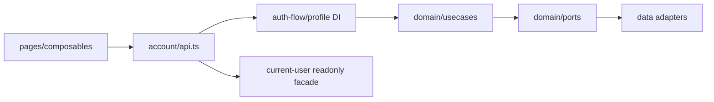
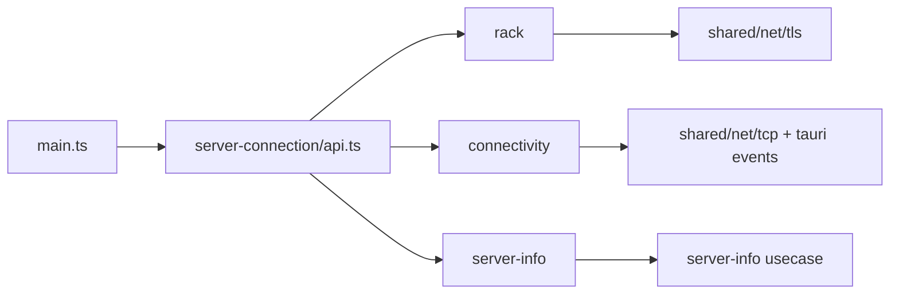
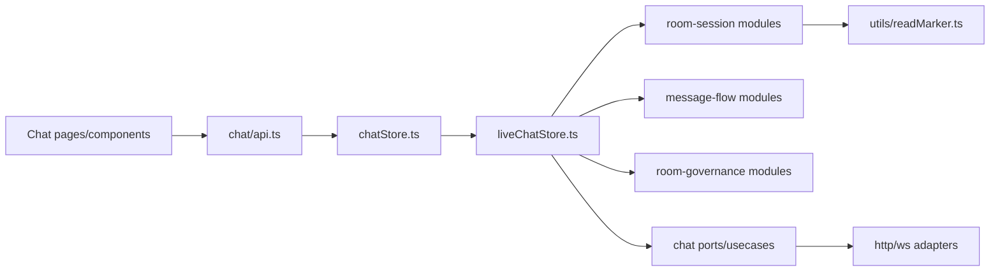
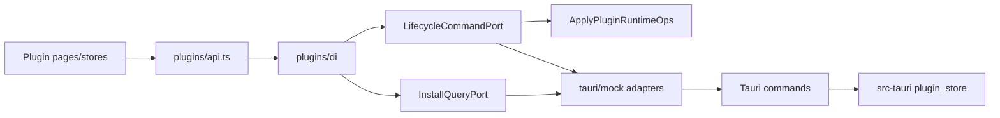
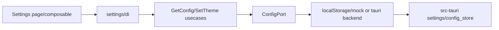
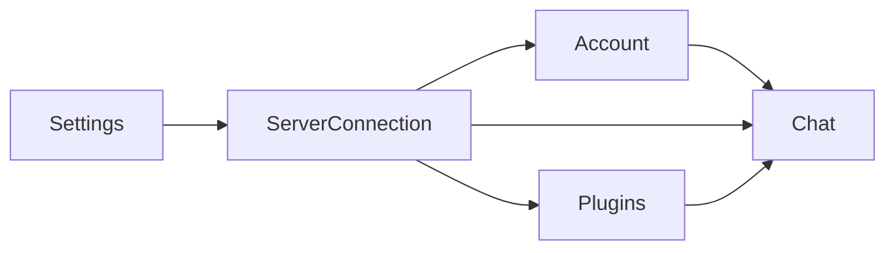

# Feature 设计图（调用链 + 依赖方向）

更新时间：2026-03-08
范围：`src/features/{account,server-connection,chat,plugins,settings}`

---

## 1. account

### 1.1 定位
- 身份域聚合：认证流程（auth-flow）+ 当前用户态（current-user）+ 资料能力（profile）。
- 对外入口：`src/features/account/api.ts`

### 1.2 主调用链
1. 登录页/启动流程调用 `account/api` 暴露的 usecase（如验证码登录、required gate 校验）。
2. `auth-flow/di` 按 mock mode 选择 port 实现（HTTP 或 mock）。
3. 用例执行后，通过受控函数更新展示态（如 `setCurrentUser`、required gate 状态更新函数）。

### 1.3 依赖方向

---

## 2. server-connection

### 2.1 定位
- 统一服务器上下文：server rack、连接状态、server-info。
- 对外入口：`src/features/server-connection/api.ts`

### 2.2 主调用链
1. `main.ts`（主窗口）调用 `startServerConnectionRuntime()`。
2. runtime 启动三部分：
- rack runtime（TLS provider）
- server-info runtime（scope cleanup）
- connectivity runtime（tcp frame/state listener + provider）
3. 页面通过 `connectNow/connectWithRetry/useCurrentServerContext/useServerInfoStore` 消费能力。

### 2.3 依赖方向

---

## 3. chat

### 3.1 定位
- 聊天域聚合：room-session、message-flow、room-governance。
- 对外入口：`src/features/chat/api.ts`

### 3.2 主调用链
1. 页面通过 `chat/api` 消费 store 门面（`chatStore.ts`）。
2. `liveChatStore` 聚合子模块：
- 会话就绪编排（ensureReady）
- WS 事件路由
- 消息分页/发送/治理动作
- read-state 上报
3. 读状态统一使用 `time + mid` 比较器（`presentation/utils/readMarker.ts`）。
4. catchup + polling 全链路带 `socket + scopeVersion` 陈旧保护。

### 3.3 依赖方向

---

## 4. plugins

### 4.1 定位
- 插件目录、安装生命周期、运行时挂载、domain 注册。
- 对外入口：`src/features/plugins/api.ts`

### 4.2 主调用链
1. UI store (`pluginCatalogStore` / `pluginInstallStore` / `domainRegistryStore`) 从 `plugins/di` 获取端口。
2. DI 拆分 Query/Command：
- `PluginInstallQueryPort`
- `PluginLifecycleCommandPort`
3. 运行时敏感流程（enable/disable/uninstall/切版本）经 `ApplyPluginRuntimeOps` 编排。
4. Rust 侧 `plugin_store` 负责安装态和本地存储，写入路径采用锁 + 原子替换（含 Windows replace）。

### 4.3 依赖方向

---

## 5. settings

### 5.1 定位
- 应用配置读取与写入（前端 usecase + Rust config store）。

### 5.2 主调用链
1. 设置页面 model 通过 `settings/di` 获取 `ConfigPort`。
2. `GetConfig/SetTheme` 等 usecase 操作配置。
3. Rust `config_store` 提供读取、按类型提取、并发安全更新（写锁 + 原子写）。

### 5.3 依赖方向

---

## 6. 跨 Feature 协作图

说明：
- `ServerConnection` 提供 socket/server-info/TLS 语义给 `account/chat/plugins`。
- `Plugins` 提供 domain runtime 给 `chat` 渲染与 composer。
- `Account` 提供当前用户上下文给 `chat`（如读状态归因、消息归属显示）。

---

## 7. 当前设计约束（已落地）

1. 跨 feature 访问只走 `features/<feature>/api.ts`。
2. 运行时副作用避免模块加载即执行，统一显式启动。
3. 展示层全局态优先只读暴露，写操作通过受控函数。
4. 聊天读状态统一二元标记（`last_read_time + last_read_mid`）。
5. Rust 关键配置/存储写入采用并发保护与原子替换。
